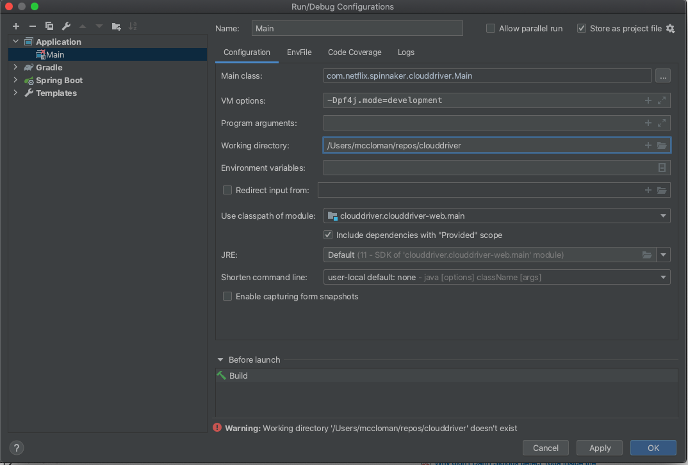

## Spinnaker Plugin for AWS account registration - Developer Guide

### Requirements:
1. JDK11 installed.
2. Must have an instance of Spinnaker running in [a Kubernetes cluster](https://github.com/armory/spinnaker-operator).
3. [Telepresence](https://www.telepresence.io/) 
4. Docker

### Overview:
1. The credentials load flow diagram [can be found here](https://github.com/spinnaker/clouddriver/pull/5056).
2. This plugin replaces the `CredentialsDefinitionSource` Spring beans for AWS and ECS providers. It also replaces the `CredentialsRepository` bean for AWS.
3. For general information on how to develop plugins: https://spinnaker.io/community/gardening/spin-contrib

### IntelliJ configuration:
1. Clone [clouddriver](https://github.com/spinnaker/clouddriver) locally.
2. Open this plugin repository in IntelliJ and let it finish indexing.
3. [Link clouddriver project](https://www.jetbrains.com/help/idea/gradle.html#link_gradle_project) with this project.
4. Create a new run configuration. Note that the `-Dpf4j.mode=development` option is required for debugging.


### Build plugin:
```
mkdir <CLOUDDRIVER_REPO_PATH>/plugins
rm -rf account-registration/build \
 && ./gradlew releaseBundle \
 && cp account-registration/build/*.plugin-ref <CLOUDDRIVER_REPO_PATH>/plugins
```
This will create the `plugins` directory in clouddrier repo and places the plugin-ref file in that directory.
 
### Run:
1. Get cluster configuration to local machine.
    - `cd <CLOUDDRIVER_REPO_PATH>`
    - `telepresence --namespace spinnaker --swap-deployment spin-clouddriver --env-file env-telepresence`
    - `cp -R $TELEPRESENCE_ROOT/opt/spinnaker/config/ ~/.spinnaker`
    - comment out `plugins-root-path:` key in ~/.spinnaker/clouddriver.yml
    - Update ~/.spinnaker/clouddriver.yml with configuration properties specified in README.
2. Run or connect to cache instance:
    - If you want to use local caching instance:
        - `docker run -d -p 6379:6379 --name redis redis:6.0.8`
        - Edit `~/.spinnaker/spinnaker.yml` file and update redis' baseUrl to `baseUrl: redis://localhost:6379`.
    - If you want to use remote caching instance:
        - Be sure telepresence shell is active. 
3. Run the IntelliJ configuration.
4. Once it builds clouddriver and start running. You should verify the following in logs:
    - `pf4j` is in development mode. One of the first several logs will indicate this. 
    - Plugin is found and loaded. There should be a log message: `AccountRegistrationPlugin plugin started`
5. Debugger can be used to debug plugin code. 
6. Use port forward to connect to UI:
    - `kubectl -n spinnaker port-forward svc/spin-deck 9000`
    - `kubectl -n spinnaker  port-forward svc/spin-gate 8084`
    - Open http://localhost:9000 for UI.

### Releasing new versions:
Release of new versions is done through Github Actions (`.github/workflows/release.yml` file).

To release a new version:
1. Update version in `gradle.properties` file in master branch.
1. Tag a commit `git tag -a <VERSION>`
2. Push the tag `git push origin <VERSION>`